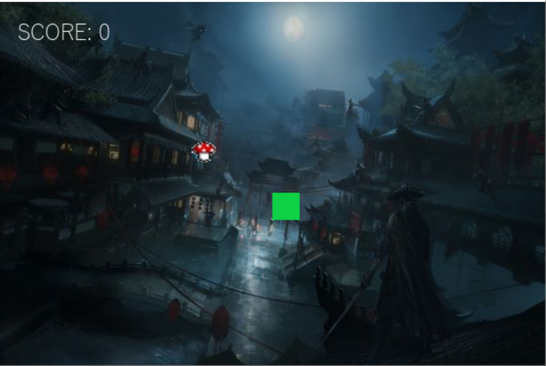
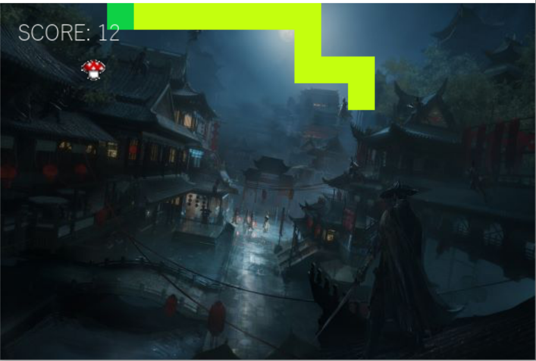
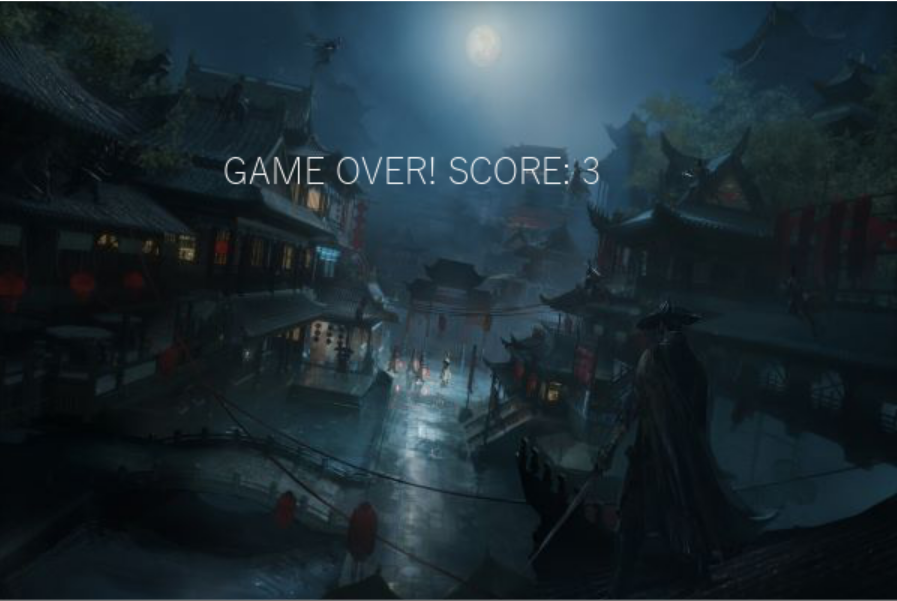

# WHITESNAKE
A Python snake game
## Table of contents
* [General info](#general-info)
* [Technologies](#technologies)
* [Controls](#controls)
* [Gameplay](#gameplay)

## General info
This game is based on the Chinese tale of the White Snake, a shape-shifting demon that fell in love with mortal, who passed away at the shock of seeing her true form. 
In order to revive her husband, she needs to gather the medicinal Lingzhi mushroom for its magical properties of reviving the dead. 
	
## Technologies
Project is created with:
Python 3.8
	
## Controls
* Up arrow - head up
* Down arrow - head down
* Left arrow - head left
* Right arrow - head right

## Gameplay
A Lingzhi randomly generates on the map. Press any arrow key to start.

For every Lingzhi you eat, your score increases by one and so does the length of your body.

If you ever run into a wall, or into your own body, then the game will be over.

